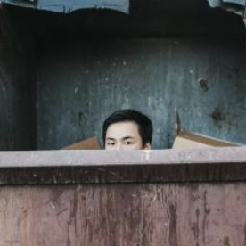

# David Shi

Hello all! I'm David (he/him), a third year in Electrical and Computer Engineering. Currently I am taking EE 201, EE 280, CSE 374, IND E 315, and ENGR 231. 

Duing my free times, I like to hang out with friends, play video games (FPS shooters and Genshin), cooking and gyming. I'm a big fan of Marvel and enjoy watching animes. My go to drink is Green Tea frap from Starbucks.

I haven't explored much of Seattle since I don't have my car with me right now, but I hope that my parents will let me bring it during the summer. 
